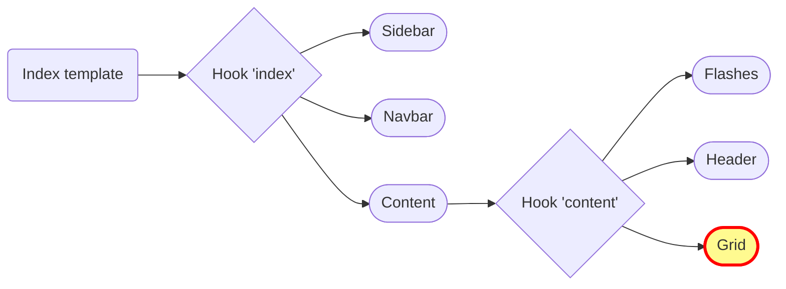

## Push, Push, Push!


<!--
*Loïc*
-->

---
layout: center
name: mystery-slide
title: Mystery surprise 👀
---

# 🧟 New Grid Live Component

it's alive...

<!--
*Loïc*
-->

---
layout: image
image: /pit_stop.gif
---

<!--
*Loïc*
-->

---
transition: fade
---

## Twig hooks overview
index operation


---

## Twig hooks overview
index operation



<!--
*Loïc*

How can we make our grid, a LIVE grid ?

First, we need to look at our Twig template definition.

In Sylius, we have a Twig template tree of blocks which we can customize.

We need to replace the default blocks to use our future grid component 

The main template is the index template.

Here is an overview of the Twig Hooks definition that configures more blocks inside the index template.

By default, our grid is just a template which we can override with our new grid component

Deïïïta table component
-->

---
transition: fade
---

## Twig hooks overview
index operation


<div style="position:absolute; top:340px; left:170px; width:680px; height:20px; border:2px solid red; border-radius:8px;"></div>

<!--
*Loïc*

Driver grid
in the Symfony Web Profiler page

Twig Hooks list

Grid Hook contains the data_table hook which is a template.
-->

---

## Twig hooks updated
index operation


<div style="position:absolute; top:340px; left:170px; width:680px; height:20px; border:2px solid red; border-radius:8px;"></div>

<!--
*Loïc*

we replace the data_table hook to use our component instead.
-->

---
layout: two-cols
---

Overview of the new DataTableComponent

```php {all|5,8,11,14,17}
#[AsLiveComponent(name: 'sylius_grid_data_table')]
final class DataTableComponent
{
    #[LiveProp(writable: true)]
    public string|null $grid = null;

    #[LiveProp(writable: true)] 
    public int $page = 1;
    
    #[LiveProp(writable: true)]
    public array|null $criteria = null;

    #[LiveProp(writable: true)]
    public array|null $sorting = null;

    #[LiveProp(writable: true)]
    public int|null $limit = null;
}
```

::right::

Transform your grid into a Live Component

```yaml {none|all|7-11}
sylius_twig_hooks:
    hooks:
        'sylius_admin.book.index.content.grid':
            data_table:
                component: 'sylius_grid_data_table'
                props:
                    grid: '@=_context.grid'
                    page: '@=_context.page'
                    criteria: '@=_context.criteria'
                    sorting: '@=_context.sorting'
                    limit: '@=_context.limit'                    
```

<!--
*Loïc*

@= "at equals" signals that we use Expression Language syntax

_context is the native Twig associative array that contains all the variables available in the current template.
-->

---

<video width="700" controls autoplay loop>
  <source src="/drivers_with_component.webm">
</video>

<!--
*Loïc*

Live demo of our Live Component grid

Pagination : Change pages without refreshing the whole page. 

It also changes the Number of items with the same UX.
-->

---

## Use it in any template

Including your grid in a details page.

```twig {all|3|4-6}
<!-- templates/session/show/body.html.twig -->
{{ component('sylius_grid_data_table', {
    grid: 'driver',
    criteria: {
        session: session.id,
    },
}) }}
```

<!--
*Loïc*

Another benefit is you can use it as  a lego piece in any page, including details pages.

Indicate the grid name + criteria for filtering

Craïtiiiiriiiiaaaaaa
-->

---

<video width="800" controls autoplay loop>
  <source src="/session_details.webm">
</video>

<!--
*Loïc*

Here is a Live details page of Session race

Drivers of the current session : we embark a prefiltered grid inside a details page with pagination and so on
-->

---
layout: center
---

Grids and Filters as Live Components

<video width="800" controls autoplay loop>
  <source src="/filters.webm">
</video>

<!--
*Loïc*

Live component filters
Each filter type needs a specific live component
- country "custom" => select

Still experimental 

TODO: check code related to live filter component !!!!
-->
