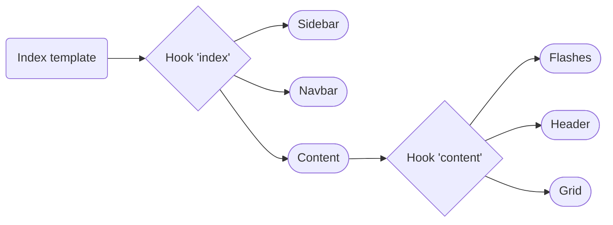
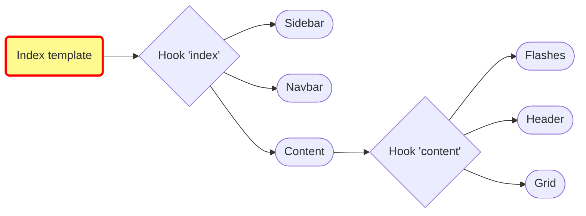

## Push, Push, Push!


<!--
*Estelle*

GridBundle 1.14 introduced a whole bunch of modernized DX improvements which greatly improve our lives but we didn't forget our users and we're currently working on UX improvements too to introduce some reactive behaviour with grids that work as Single Page apps using Live Components, so let's dive deeper into the implementation of this experimental feature with Loïc.

-->

---
layout: center
name: mystery-slide
title: New Live Component Grid 🧟
---

# 🧟 New Live Component Grid

it's alive...

<!--
*Loïc*

Thank you Estelle for this great introduction.

Now, buckle up and let's take a leap to the future.

As Sylius introduced Symfony UX usage into its stack, we are able to add super-powers on the grids. 
-->

---
layout: image
image: /pit_stop.gif
---

<!--
*Loïc*

Here we go
-->

---
transition: fade
---

## Twig hooks overview
index operation



<!--
*Loïc*

How can we make our grid, a LIVE grid ? That's a good question, right?

First, we need to look at our Twig template definition.

In Sylius, we have a Twig template tree of blocks which we can customize.

We need to replace one of the default blocks to use our future grid component.
-->

---
transition: fade
---

## Twig hooks overview
index operation



<!--
*Loïc*

The main template is the index one.

Here is an overview of the Twig Hooks definition that configures more blocks inside the index template.

-->

---
transition: fade
---

## Twig hooks overview
index operation


<!--
*Loïc*

By default, our grid is just a template which we can override to use the new grid component.
-->

---
transition: fade
---

## Twig hooks overview
index operation


<div style="position:absolute; top:310px; left:150px; width:274px; height:20px; border:2px solid blue; border-radius:8px;"></div>

<div style="position:absolute; top:340px; left:170px; width:680px; height:20px; border:2px solid red; border-radius:8px;"></div>

<!--
*Loïc*

You can see all the Twig blocks in the Symfony Web-Profiler page. So it's easy to debug.

Here is the Twig Hooks list.

Just have a look on the hook named `sylius_admin.driver.index.content.grid` in blue color.
This grid Hook contains `data_table` block which is a template.
-->

---

## Twig hooks updated
index operation


<div style="position:absolute; top:310px; left:150px; width:274px; height:20px; border:2px solid blue; border-radius:8px;"></div>

<div style="position:absolute; top:340px; left:170px; width:680px; height:20px; border:2px solid red; border-radius:8px;"></div>

<!--
*Loïc*

We are going to replace the data_table block to use our component instead as you can see.

Now... how are we gonna do it?
-->

---
layout: two-cols
---

Overview of the new DataTableComponent

```php {all|5,8,11,14,17}
#[AsLiveComponent(name: 'sylius:grid:data_table')]
final class DataTableComponent
{
    #[LiveProp(writable: true)]
    public string|null $grid = null;

    #[LiveProp(writable: true)] 
    public int $page = 1;
    
    #[LiveProp(writable: true)]
    public array|null $criteria = null;

    #[LiveProp(writable: true)]
    public array|null $sorting = null;

    #[LiveProp(writable: true)]
    public int|null $limit = null;
}
```

::right::

Transform your grid into a Live Component

```yaml {none|all|3|4|5|6-11}
sylius_twig_hooks:
    hooks:
        'sylius_admin.grid.index.content.grid':
            data_table:
                component: 'sylius:grid:data_table'
                props:
                    grid: '@=_context.grid'
                    page: '@=_context.page'
                    criteria: '@=_context.criteria'
                    sorting: '@=_context.sorting'
                    limit: '@=_context.limit'                    
```

<!--
*Loïc*

Here is an overview of a component that we called "DataTableComponent".
It contains basic properties:
* The grid, which is the name of the grid to use
* Page which is the current page
* Criteria for data filtering
* Sorting
* And finally, the limit one to specify items per page

Do you remember the hook name?

We redefined the data_table block in order to use the component.

We define all the props that are the Twig template variables to pass to our Live components.


@= "at equals" signals that we use Expression Language syntax.

_context is the native Twig associative array that contains all the variables available in the current template.
So, this _context variable is not specific to the Twig hooks package. it comes from the Twig package.
-->

---

<video width="700" controls autoplay loop>
  <source src="/drivers_with_component.webm">
</video>

<!--
*Loïc*

So here is the Live demo of our Live Component grid

We have a pagination without refreshing the whole page. 

It also changes the Number of items with the same UX.
We are going from ten items per page to twenty-five items per page, and only the data will be updated.
-->

---

## Use it in any template

Including your grid in a details page.

```twig {all|3|4-6}
<!-- templates/session/show/body.html.twig -->
{{ component('sylius_grid_data_table', {
    grid: 'driver',
    criteria: {
        session: session.id,
    },
}) }}
```

<!--
*Loïc*

Another benefit is you can use it as a lego piece in any page, including a details page.

You need to indicate the grid name and criteria for filtering

Craïtiiiiriiiiaaaaaa
-->

---

<video width="800" controls autoplay loop>
  <source src="/session_details.webm">
</video>

<!--
*Loïc*

Here is a Live details page of Session race

Drivers of the current session : we embark a prefiltered grid inside a details page with pagination and so on.

The great benefit of this approach is that we can have multiple grids within the same page.

All of which can be prefiltered and customised.

So this is a very nice feature.
-->

---
layout: center
---

Grids and Filters as Live Components

<video width="800" controls autoplay loop>
  <source src="/filters.webm">
</video>

<!--
*Loïc*

Now, we can go deeper with Live component filters.

Each filter type (taïpe) needs a specific live component.

The country filter will use the SelectFilterComponent.

It's still very experimental.

As you can see, we can also use text input and update the data during input.
-->

---

## Live Component Filters

```php
final class SelectFilterComponent
{
    #[LiveProp(writable: true)]
    public string|null $selectedValue = null; // selected value of the select input
}
```

```php
final class StringFilterComponent
{
    #[LiveProp(writable: true)]
    public string|null $value = null; // query string of the text input
}
```

```php
final class DateFilterComponent
{
    #[LiveProp(writable: true)]
    public string|null $fromDate = null;

    #[LiveProp(writable: true)]
    public string|null $fromTime = null;

    #[LiveProp(writable: true)]
    public string|null $toDate = null;

    #[LiveProp(writable: true)]
    public string|null $toTime = null;
```

<!--
*Loïc*

These are some of the Live components for the built-in filter types.

The SelectFilter one is used for our country filter for example.

The StringFilter one can be used for a search input.

And the DateFilter one can be used to filter according to a given period.
-->
