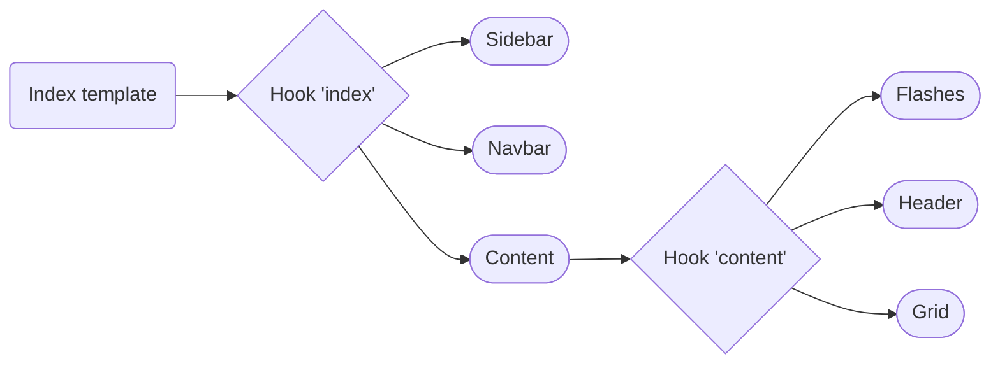

## Push, Push, Push!


<!--
*Loïc*
-->

---
layout: center
name: mystery-slide
title: Mystery surprise 👀
---

# 🧟 New Grid Live Component

it's alive...

<!--
*Loïc*
-->

---
layout: image
image: /pit_stop.gif
---

<!--
*Loïc*
-->

---


## Twig hooks overview
index operation



---

## Twig hooks overview
index operation


---

## Twig hooks updated
index operation


---
layout: two-cols
---

Overview of the new DataTableComponent

```php {all|5,8,11,14,17}
#[AsLiveComponent(name: 'sylius_grid_data_table')]
final class DataTableComponent
{
    #[LiveProp(writable: true)]
    public string|null $grid = null;

    #[LiveProp(writable: true)] 
    public int $page = 1;
    
    #[LiveProp(writable: true)]
    public array|null $criteria = null;

    #[LiveProp(writable: true)]
    public array|null $sorting = null;

    #[LiveProp(writable: true)]
    public int|null $limit = null;
}
```

::right::

Transform your grid into a Live Component

```yaml {none|all|7-11}
sylius_twig_hooks:
    hooks:
        'sylius_admin.book.index.content.grid':
            data_table:
                component: 'sylius_grid_data_table'
                props:
                    grid: '@=_context.grid'
                    page: '@=_context.page'
                    criteria: '@=_context.criteria'
                    sorting: '@=_context.sorting'
                    limit: '@=_context.limit'                    
```

<!--
*Loïc*
-->

---

## Use it in any template

Including your grid in a details page.

```twig {all|4-6}
<!-- templates/session/show/body.html.twig -->
{{ component('sylius_grid_data_table', {
    grid: 'team_radio',
    criteria: {
        session: session.id,
    },
}) }}
```

<!--
*Loïc*

TODO ajouter l'image du résultat
-->

---
layout: center
---
Grids and Filters as Live Components

<video width="800" controls autoplay="true">
  <source src="/openf1_live_grid.mp4" type="video/mp4">
</video>

<!--
*Loïc*

Refaire la vidéo, en allant doucement pour avoir le temps de décrire les actions.
-->
